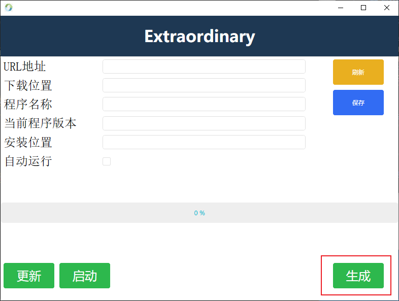
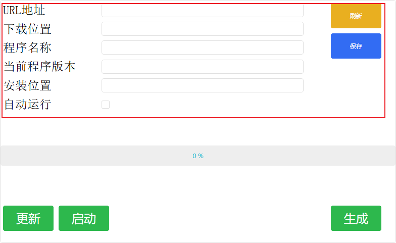
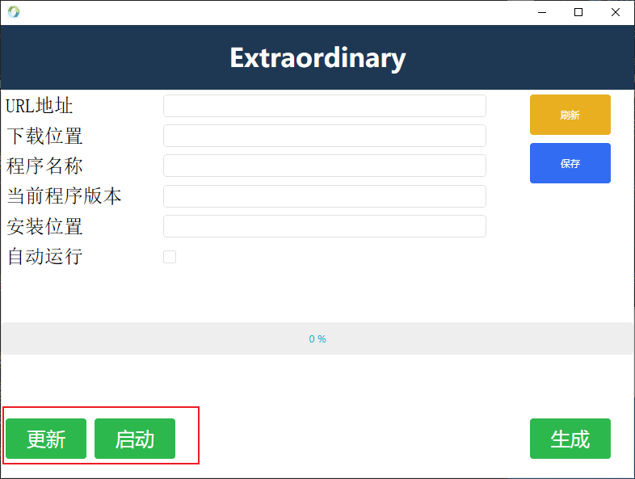

# AutoUpdata

这是一个可通过远程服务器自动更新APP程序的软件

## 这个程序是做什么？

- 微软的ClickOnce停止更新了
- 其他自动更新的程序要么收费，要么不适配我的需求
- 当涉及到在局域网内，使用同一个程序时，需要人手动复制、黏贴、解压，作为受过高等教育的新时代青年，这种繁琐且重复的工作，就应该自动。

## 这个程序怎么用？

- 首先你需要一个IIS的服务端
- 将你的程序打包成zip，并放置在IIS中
- 点击生成按钮，选择你的程序压缩包，然后他就会在你的压缩包的同级目录下生成一个服务端配置文件(程序更新时，是需要读取这个文件，比对MD5信息)
- 
- 至此，服务端的配置结束

- 其次，在需要程序运行的局域网电脑中，配置更新参数
- 
- 配置完记得保存刷新(它会在程序运行的目录下生成一个配置文件)
- 点击【更新】将会从远程服务端下载程序文件
- 点击【启动】将会直接从安装目录寻找程序启动
- 
- 如果你勾选了【自动运行】，它会在程序启动的时候自动执行一遍更新操作

## 下载链接

- 自己去Releases下载，别啥都问我 
